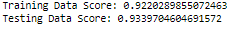
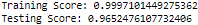
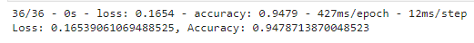
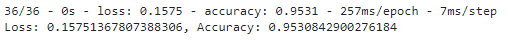

# 
 You've Got Mail 

## Overview

This collaborative project was created to assist the user in identifying which emails or texts messages they receive are spam or ham (normal). Spam emails and text messages were gathered from various datasets. Machine learning was utilized to produce these results; multiple models were pre-processed, trained, and tested to uncover the model wtih the most accuracy. 

## Analysis

Data was collected from multiple data sets to identify which messages were labeled as spam or ham. The data was then pre-processed, filtered, and trained using multiple machine learning models. Furthermore, word-count and frequency of specific words within a message were analyzed to determine if these factors had an effect on determining if the message was spam or ham.

Based on a UCI machine learning benchmark database named spambase where 57 features have already been extracted for each email message and all instances were labelled as “0” (normal) or “1” (spam).
A typical scenario for machine learning is to create a learning system by training it on a given training data set. Later on the system will be applied to different test data sets. Various machine learning models were used to uncover the most useful model. 

### Machine Learning Models

<h5>Logisitc Regression Model (Email Spam Detection)</h5> 
<h6>Using supervised machine learning, this model attempts to distinguish between spam or ham based on class values. <h6>

<h5> Random Forest Classifier (Email Spam Detection)</h5>
<h6>This model determined predictive accuracy by averaging descision tree classifiers from the entire dataset <h6>

<h5>Sequential Model /#1 (Email Spam Detection)<h5>
<h6>This sequential model used two hidden layers, trained using 50 epochs, and had a total of 701 parameters. <h6>

<h5>Sequential Model #2 (Email Spam Detection)</h5>
<h6>This sequential model used two hidden layers, trained using 50 epochs, and had a total of 1,601 parameters. <h6>

## Datasets

Email Spam Detection: https://www.kaggle.com/code/mfaisalqureshi/email-spam-detection-98-accuracy/data

Email Spam Classification: https://www.kaggle.com/datasets/balaka18/email-spam-classification-dataset-csv

SMS Spam Collection Dataset: https://www.kaggle.com/datasets/uciml/sms-spam-collection-dataset

## Tools Used

-Jupyter Notebook 
-Google Colab
-PySpark
-Bootstrap
-Flask

